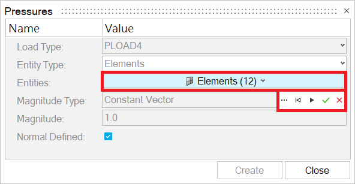
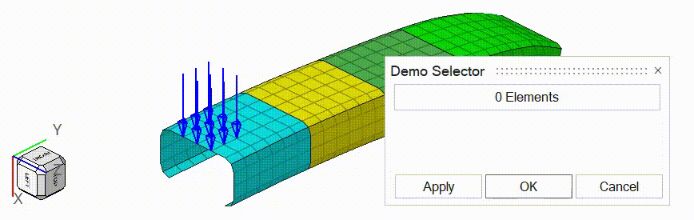

HyperMesh has a familiar control called **entity selector** that lets the user select entities of a specific type, such as components, elements, or surfaces. The screenshot below shows it in the native Pressures panel.



Clicking the button turns it into a selector with a few small icons (advanced selection, reset, apply, OK, and cancel). After a selection is made, the number of selected entities appears in parentheses.

Unlike basic widgets such as `hwtk::button` and `hwtk::combobox`, this control has no code examples in the official documentation. So I dug through the Tcl files in the HyperWorks installation directory to figure out how to build it into my own extension. This article describes one way to do it, based on what I found.

---

## Step 1: Create a Namespace

First, create a namespace to hold the selection for later use.

```tcl
namespace eval ::demo_selector {
    variable selected_ids {}
}
```

The variable `selected_ids` keeps a copy of the selected entity ids. These ids can then be used for any further action the user needs.

---

## Step 2: Create the Widgets

The control itself is assembled from these widgets:

| Widget | Role |
| :--- | :--- |
| `hmtk::entityselector` | The selector which owns the selection logic. |
| `hwctx::guidebar` | The guide bar that visually hosts the selector. |
| `hwtk::button` | A dummy button that shows the current entity type and count. |
| `hwtk::buttonbar` | A floating bar with the Advanced, Reset, OK, and Cancel icons. |

The code below creates these widgets inside a dialog.

```tcl
# widgets for dialog and container for entity selector
set dialog         [hwtk::dialog .dialog -title "Demo Selector"]
set recess         [$dialog recess]
set frame_cell     [hwtk::frame $recess.frame_cell]

# widgets for entity selector
set guidebar       [hwctx::guidebar $frame_cell.guidebar -fillet 2]
set button         [hwtk::button $frame_cell.button]
set buttonbar      [hwtk::buttonbar [winfo toplevel $recess].buttonbar -showseparator 0]
set entityselector [hmtk::entityselector $frame_cell.entityselector \
    -guidebar           $guidebar \
    -types              "Elements Nodes" \
    -defaultentity      "Elements" \
    -selectmode         multiple \
    -isembeddedselector 1 \
    -showcount          1 \
    -showreset          0 \
    -showadvanced       0 \
    -showaccept         0 \
    -showcancel         0 \
    -syncwithbrowser    false \
    -restorelastentity  0 \
    -useeventhandler    true \
    -acceptcommand      "" \
    -cancelcommand      "" \
]
```

The key widget above is `hmtk::entityselector`, but it cannot stand on its own. It needs a `hwctx::guidebar` as its host, which is passed in through the `-guidebar` option. The `hmtk::entityselector` handles the selection logic, while the `hwctx::guidebar` provides the visible selector. Only the `hwctx::guidebar` needs to be gridded, and the `hmtk::entityselector` logic then works through it.

Setting `-showreset`, `-showadvanced`, `-showaccept`, and `-showcancel` to `0` hides the built-in icons of the `hmtk::entityselector`. The `-acceptcommand` and `-cancelcommand` options are also left empty. This is because native HyperMesh dialogs don't use the built-in button bar.

Instead, a separate `buttonbar` is created explicitly, as shown in the code. It is created directly on the dialog's toplevel window rather than inside `frame_cell`, so it can later float over the cell with `place`.

A few other options of the `hmtk::entityselector` deserve explanation:

- `-types`: sets the entity types the user can switch between.
- `-defaultentity`: sets the entity type selected initially.
- `-selectmode`: sets whether the user can select a `single` entity or `multiple` entities.
- `-isembeddedselector`: sets whether the selector is embedded in a dialog.
- `-showcount`: sets whether the number of selected entities is shown.
- `-syncwithbrowser`: sets whether the selector syncs with the model browser.
- `-restorelastentity`: sets whether the entity type selected last time is restored.

In addition, a `hwtk::button` is created. It is a dummy button placed in exactly the same position as the `hwctx::guidebar`.

---

## Step 3: Lay Out the Widgets

Here is the complete layout code:

```tcl
grid $frame_cell -row 0 -column 0 -sticky ew -padx 4 -pady 4
grid $guidebar   -row 0 -column 0 -sticky ew

grid columnconfigure $recess 0 -weight 1
grid columnconfigure $frame_cell 0 -weight 1
```

Gridding `frame_cell` into the dialog is ordinary layout. As mentioned earlier, the `entityselector` has no appearance of its own, so it is never gridded. Instead, it is displayed through the `guidebar` passed in with `-guidebar`, and the guide bar is what actually appears on screen.

Setting `columnconfigure` with `-weight 1` lets the entity selector stretch to the full width of the dialog.

The interesting part is that the dummy button and the button bar are not laid out here. The dummy button is gridded into the same cell later, so it covers the guide bar. At rest, the user only sees the dummy button. When it is clicked, the dummy button disappears to reveal the guide bar underneath, and the button bar appears at the same time.

---

## Step 4: Configure the Dummy Button and Button Bar

Next, configure the commands. Clicking the dummy button starts a selection session. Each small button in the button bar forwards to a method of the selector or to one of our own procedures.

```tcl
$button configure \
    -command [list ::demo_selector::activate_selector $frame_cell $button $buttonbar $entityselector]

$buttonbar add a_advance \
    -image "toolbarMoreOptionsStrip-16.png" \
    -indicator hide \
    -help "Advanced Selection" \
    -command [list $entityselector OpenAdvancedSelection]

$buttonbar add a_reset \
    -image "toolbarActionResetStrip-16.png" \
    -indicator hide \
    -help "Reset" \
    -command [list $entityselector ExecSelectionCommand Clear]

$buttonbar add a_accept \
    -image "toolbarActionOKStrip-16.png" \
    -indicator hide \
    -help "OK" \
    -command [list ::demo_selector::on_accept $entityselector $buttonbar $button]

$buttonbar add a_cancel \
    -image "toolbarActionCancelStrip-16.png" \
    -indicator hide \
    -help "Cancel" \
    -command [list ::demo_selector::on_cancel $entityselector $buttonbar $button]
```

Advanced Selection and Reset call methods of the selector directly. The dummy button, OK, and Cancel call our own procedures below.

```tcl
proc ::demo_selector::activate_selector {frame_cell button buttonbar entityselector} {
    variable selected_ids
    set selected_ids [$entityselector ExecSelectionCommand GetSelectionIds]
    set cell_width  [winfo width $frame_cell]
    set cell_height [winfo height $frame_cell]

    grid forget $button
    place $buttonbar -in $frame_cell -anchor ne -x $cell_width -y $cell_height
    raise $buttonbar
    $entityselector SetActive
    $entityselector UpdateButtonWidth
}
```

The procedure `activate_selector` hides the dummy button itself with `grid forget`, revealing the guide bar underneath. It then floats the button bar at the corner of the cell and raises it on top. It also activates the selector with `SetActive` and saves the current selection to `selected_ids`.

```tcl
proc ::demo_selector::on_accept {entityselector buttonbar button} {
    set ids        [$entityselector ExecSelectionCommand GetSelectionIds]
    set entitytype [$entityselector GetEntityType]
    $entityselector SetInactive
    place forget $buttonbar
    ::demo_selector::_update_dummy_button $button $entitytype [llength $ids]
    raise $button
}
```

The procedure `on_accept` reads the new selection, deactivates the selector, and removes the button bar. The dummy button then comes back with the new count as its label.

```tcl
proc ::demo_selector::on_cancel {entityselector buttonbar button} {
    variable selected_ids
    $entityselector ExecSelectionCommand Clear
    if {[llength $selected_ids]} {
        $entityselector ExecSelectionCommand SelectByAdvanced "by id" $selected_ids
    }
    set entitytype [$entityselector GetEntityType]
    $entityselector SetInactive
    place forget $buttonbar
    ::demo_selector::_update_dummy_button $button $entitytype [llength $selected_ids]
    raise $button
}
```

The procedure `on_cancel` does the same, except that it restores the previous selection first. The selector has no built-in "undo" for a selection session. So Cancel clears whatever was picked and re-selects the ids saved in `selected_ids` with `SelectByAdvanced "by id"`.

Both `on_accept` and `on_cancel` bring back the dummy button with the helper below. It grids the button into the cell and updates its label with the entity type and count.

```tcl
proc ::demo_selector::_update_dummy_button {button entitytype {count 0}} {
    grid $button -row 0 -column 0 -sticky nsew
    $button configure -text "$count $entitytype"
}
```

---

## Step 5: Show the Dialog

Finally, the dummy button has not been gridded yet. So before the dialog first appears, call the helper `::demo_selector::_update_dummy_button` once to put the dummy button on top of the guide bar. The entity type passed in is `Elements`, which matches the `-defaultentity` of the selector. The count is omitted, so it falls back to `0` and the button reads `0 Elements`. Then post the dialog with `$dialog post`.

```tcl
::demo_selector::_update_dummy_button $button "Elements"
$dialog post
```

And here it is! The animation below shows what we have built, working just like the native one.

{: style="max-width: 480px"}
