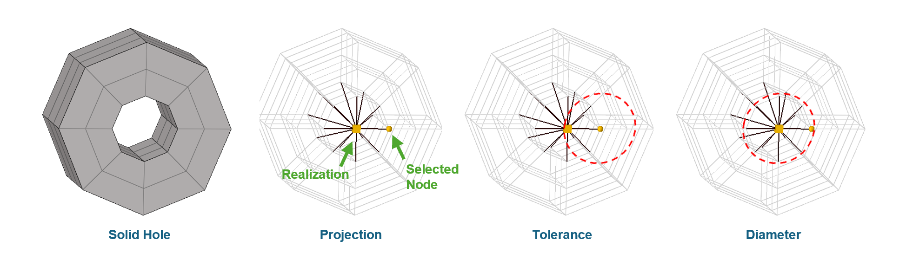
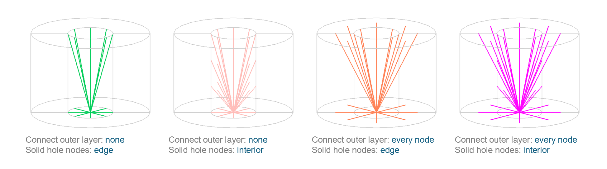
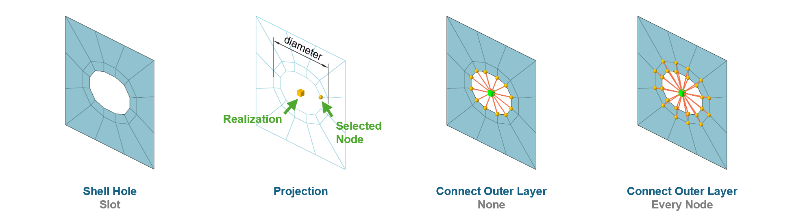
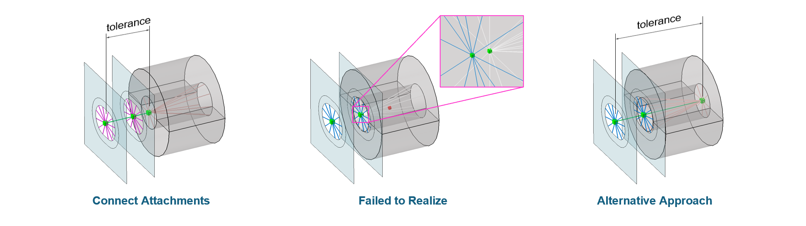

## Attachment to Solid Hole

In HyperMesh, 
the `Hole` controller can be used to create attachments. 
Once a selected node is identified, 
the **realization** entity is projected, 
and a representative **rigid element** is generated. 
This process is known as **Projection**.

To ensure the connector captures the intended geometry, 
it is critical to distinguish between two key parameters:

- `Tolerance`: defines the searching radius originating from the selected node. 
  It determines the range within which HyperMesh scans the realization position. 
  If the hole's center falls outside this radius, 
  the realization will fail.
- `Diameter`: defines the captured hole size. 
  If the actual hole diameter is smaller than the specified diameter, 
  the realization will not be validated.

---

HyperMesh provides two specific options control over how the rigid element forms. 

The option `Connect Outer Layer` controls the reach of the connector, 
which is particularly useful for simulating a **washer**.
- `None`: Only captures nodes directly on the cylinder surface of the hole.
- `Every Node`: Nodes located within one element edge distance will also be captured.

The option `Solid Hole Nodes` defines the body of the connector.
- `Edge`: Only the nodes on the top and bottom circular edges of the hole are connected.
- `Interior`: Includes all nodes along the internal cylindrical surface of the hole.

---

## Attachment to Shell Hole

The `Hole` controller can be applied to shell holes using the same logic as solid holes. 
However, since shell elements lack thickness depth, 
the `Solid Hole Nodes` option has no effect on the realization for shell.

One of the flexible features of this controller is that the hole does not necessarily need to be a perfect circle. 
It can effectively handle slot holes.
In the case of a slot, 
the `diameter` should be set based on the **major axis** (longer side length) of the slot.

---

## Connecting Attachments for Bolt Modeling

To complete a bolt representation, 
the previously created attachments must be interconnected. 
This can be achieved by creating a **connector** by selecting attachments.

In this case, the `tolerance` parameter defines the maximum searching distance between the realization points of the selected attachments.
The distance between any two selected attachments must be smaller than the specified tolerance.

When creating a connector by selecting attachments, 
the `diameter` parameter typically has no effect, 
as the size is already governed by the individual attachments.

The system supports more than two attachments. 
If three or more are selected, 
multiple `RBE2` elements will be generated to form a continuous chain of connections.

A common issue occurs when two attachments are located too close to each other. 
To resolve this, try creating one of them at the opposite opening if it is a solid hole attachment.
This ensuring a more stable and successful realization.

